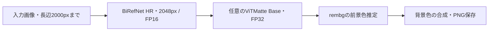

# 開発と処理の構成

[ドキュメント一覧](../README.md#ドキュメント)

## コードの場所

| ファイル | 役割 |
|---|---|
| [image_studio_app.py](../app/image_studio_app.py) | 起動、親タブの登録、キュー、一時出力の削除 |
| [image_studio_ui.py](../app/image_studio_ui.py) | 日本語UI、トリミング、印刷、工程間の受け渡し |
| [image_studio_components.py](../app/image_studio_components.py)・[components/](../app/components/) | スウォッチ、変更前後の比較、表示用画像の生成 |
| [image_studio_theme.py](../app/image_studio_theme.py) | テーマ、レイアウト、レスポンシブ表示 |
| [image_studio_backend.py](../app/image_studio_backend.py) | rembg接続、前景色推定、背景合成、出力 |
| [image_studio_gpu.py](../app/image_studio_gpu.py) | BiRefNetとrembgのsessionアダプター |
| [image_studio_refinement.py](../app/image_studio_refinement.py) | ViTMatteによる輪郭補正 |
| [image_studio_face.py](../app/image_studio_face.py) | 顔検出、ランドマーク、頭頂と顎の推定 |
| [prepare_models.py](../app/prepare_models.py) | モデルの取得、リビジョン・SHA256検証 |
| [requirements.txt](../app/requirements.txt)・[Dockerfile](../Dockerfile) | Python依存とROCm実行環境 |

## 背景処理



BiRefNetとViTMatteはAMD GPUで動きます。rembgには独自の`PortraitSession`を渡し、既存のPyTorchモデルを使います。rembg標準のONNX matting sessionへの切り替えではありません。

ViTMatteのTrimapはBiRefNetのマスクから生成します。確定した前景・背景の両方がない場合はHRマスクを維持します。前景色推定の後も完全不透明な画素は入力RGBに戻します。肌色・明るさの補正は行いません。Guided Filterは標準適用しません。

顔検出はSCRFD-10Gと2D106ランドマークをCPUで実行し、頭頂はHR人物マスクから推定します。背景変更ではクロップせず、顔配置はトリミングタブから明示的に実行します。

## UIを拡張する

新しい画像処理を追加するときは、UIを作る`build`関数を用意し、`image_studio_app.py`の`tools`へ`(名前, build関数)`を追加します。既存の「証明写真」と並ぶ親タブになります。

```python
from another_tool import build as build_another

tools = [("証明写真", build_portrait), ("新しい処理", build_another)]
```

GPU処理はGradioの直列キューを共有します。新しい処理で`queue=False`を指定して同時実行を増やさないでください。モデルを追加した場合はGPUメモリと保持するモデルの数も確認します。

カスタムUIは`app/components/`のHTML/CSS/JSで管理します。Gradioの公開APIである`props`・`watch`・`trigger`を使い、コンポーネント自身のDOMを操作します。入力画像のリセットはユーザー操作の`input`イベントで行います。画像の`change`イベントはタブ表示などでも起こるため、ナビゲーションだけで結果を消さないようにします。工程間の受け渡し後は`.then()`でプレビュー更新・古い出力の無効化を明示します。

比較用プレビューは長辺1200pxまでのJPEGです。保存するPNGの寸法には影響しません。表示用データに秘密情報や任意のユーザーHTMLを混ぜないでください。

## ビルドと確認

```bash
python -m compileall -q app
node --check app/components/palette.js
node --check app/components/comparison.js
git diff --check

docker build --build-arg VERSION="$(cat VERSION)" -t image-studio:dev .
```

PythonとNodeの確認はGPUなしでも実行できます。Dockerビルドは依存を含むため大きな空き容量が必要です。Dockerfileは実行時のimportを確認しますが、GPU推論・UIの正常動作まで保証するものではありません。

変更した範囲に応じて、GPU環境で以下を確認します。

- 背景変更: 補正ON/OFF、透過PNG、入力と同じ画角、不透明画素のRGB保持。
- UI: スウォッチ・任意色・比較バー・キーボード操作、PC/スマートフォン、明/暗テーマ、タブ往復と古い結果の無効化。
- トリミング: 顔自動配置と手動調整、300dpi・寸法、設定変更後の再保存。
- 印刷: A4/L判などの寸法、PNG/PDF、工程間の受け渡し。
- モデル更新: 固定リビジョンと取得元、チェックサム、GPUメモリ、起動時間。

写真のテストデータ・出力・モデル・認証情報はGitやビルドコンテキストへ追加しないでください。実際の人物写真を公開ドキュメントやActions artifactに含めないようにします。

関連: [リリース手順](releases.md)
